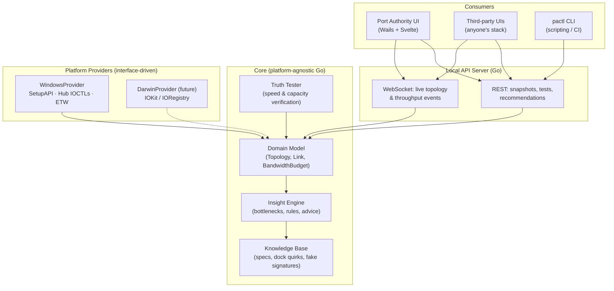
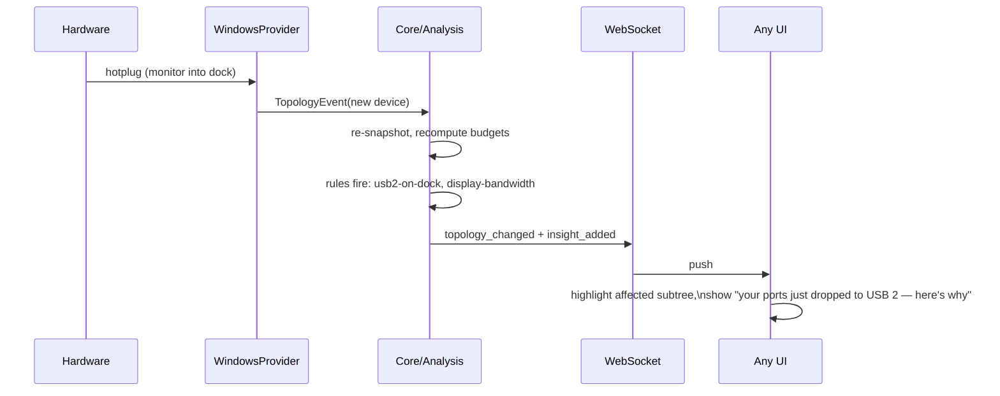

# Port Authority — Implementation Handoff

*Working title. A USB/Thunderbolt topology, bandwidth, and device-truth app for Windows (macOS-ready architecture). This document is written to be handed to an LLM (or human) for implementation.*

---

## 1. Vision

Every existing USB tree viewer shows **raw reality**: descriptors, hex dumps, spec jargon. None of them do **sensemaking**. Port Authority answers the questions people actually have:

- *Why did my external drive get slow when I plugged in my monitor?*
- *Which port should this SSD go in?*
- *Is this "USB 3.2 Gen 2" stick actually a 30MB/s potato with an aspirational label?*
- *What is my dock actually doing to my bandwidth?*

Three layers of value, in order of ambition:

1. **Reality layer** — what's connected, how, at what negotiated speed (table stakes; existing tools do this, just badly).
2. **Physics layer** — bandwidth budgets per controller/uplink, isochronous reservations, DisplayPort alt-mode lane consumption, hub chain depth. The invisible tax, made visible.
3. **Truth layer** — measured performance vs. claimed performance. Live speed testing and fake-capacity detection.

On top of all three sits a **recommendation engine** that translates findings into plain-language advice: *"Move your SSD to the port on the left side of your laptop."*

**API-first**: the backend is a standalone collector/analysis service exposing a local HTTP + WebSocket API. Our UI is merely the first consumer. Anyone who thinks they can build a better front-end is welcome to try — that's a feature, not a threat.

## 2. Non-Goals (v1)

- No device *configuration* or driver manipulation — read, measure, advise; never mutate (exception: opt-in destructive capacity test on a user-confirmed removable volume).
- No macOS implementation in v1 — but the architecture MUST make it a "swap the provider" job (see §4).
- No cloud anything. Fully local. The API binds to localhost only.
- No kernel driver. Everything achievable from user mode (admin elevation acceptable for ETW sessions).

## 3. Tech Stack Decision

**Go + Wails + Svelte** (consistent with BRUV). Rationale:

- The hard platform work is Windows API calls (SetupAPI/CfgMgr32, DeviceIoControl, ETW). Go reaches all of these via `golang.org/x/sys/windows` + syscall; no cgo strictly required.
- The product is fundamentally an **API server with a UI attached** — Go's sweet spot.
- Rust/Tauri offers no decisive advantage here; team velocity and stack consistency win.
- ETW consumption in Go is the riskiest bet. De-risk in Phase 0 (spike). Fallback options if Go ETW proves painful: (a) shell out to a small C helper, (b) use `logman`/`tracerpt` file-based sessions, (c) degrade gracefully to polling counters.

Repository shape: single repo, two artifacts — `pactl` (headless collector service, pure Go) and the Wails desktop app that embeds/launches it.

## 4. Architecture

### 4.1 Layer diagram



### 4.2 Platform abstraction

Everything platform-specific lives behind one interface. The core model, analysis engine, API, and UI never import platform packages.

```go
// package provider
type Provider interface {
    // Full topology snapshot: controllers → hubs → ports → devices.
    Snapshot(ctx context.Context) (*model.Topology, error)

    // Push channel for hotplug / link-change events.
    Watch(ctx context.Context) (<-chan model.TopologyEvent, error)

    // Live throughput per device/endpoint, best-effort.
    // Capabilities() declares what this provider can actually measure.
    Throughput(ctx context.Context) (<-chan model.ThroughputSample, error)

    Capabilities() model.ProviderCaps // e.g. HasETW, HasAltModeInfo, HasPowerDraw
}
```

`ProviderCaps` matters: macOS will expose different data (IORegistry gives great topology and alt-mode info; per-endpoint throughput differs). The UI and analysis engine must degrade gracefully based on declared capabilities, not `runtime.GOOS` checks.

### 4.3 Domain model (core types, platform-neutral)

```go
type Topology struct {
    Controllers []Controller // xHCI/Thunderbolt/USB4 root
    CapturedAt  time.Time
}

type Controller struct {
    ID, Name     string
    Kind         ControllerKind // xHCI, USB4Router, TBT3
    MaxBandwidth Bitrate        // e.g. 10 Gbps, 40 Gbps
    RootHub      Hub
}

type Hub struct {
    Device
    Ports []Port
    Depth int // chain depth from root (rule fodder)
}

type Port struct {
    Number         int
    Connected      *Device
    NegotiatedLink LinkSpeed // None, LS, FS, HS, SS5, SS10, SS20, USB4_20/40
    MaxLink        LinkSpeed // what the port could do
    AltMode        *AltModeInfo // DP lanes consumed, DSC active, etc.
}

type Device struct {
    ID            string // stable across refreshes where possible
    VendorID, ProductID uint16
    Class         DeviceClass // storage, video, audio, HID, hub...
    ClaimedSpeed  LinkSpeed   // from descriptors
    IsoReserved   Bitrate     // isochronous bandwidth reservation
    PowerDrawMA   int
    Children      []string    // drive letters, COM ports, camera names
    TruthReport   *TruthReport // nil until tested
}
```

Key derived structure — the **BandwidthBudget**: for every controller and every shared uplink (dock cables especially), compute `capacity`, `reserved` (isochronous), `measured` (live), and `alt_mode_consumed`. This is the single most valuable number set in the product.

### 4.4 Windows provider — implementation notes

- **Enumeration**: `SetupDiGetClassDevs`/CfgMgr32 to walk device tree; open hubs and issue `IOCTL_USB_GET_NODE_INFORMATION`, `IOCTL_USB_GET_NODE_CONNECTION_INFORMATION_EX` (+ `_V2` for SS link state), `IOCTL_USB_GET_DESCRIPTOR_FROM_NODE_CONNECTION`. This gets negotiated speed, port paths, descriptors, iso reservations. Reference implementations: Microsoft USBView sample (public source), Uwe Sieber's UsbTreeView (behavior reference only).
- **Detecting the classic failure**: `NegotiatedLink < min(MaxLink, ClaimedSpeed)` → device is underperforming its port. Surface this loudly.
- **Alt-mode / USB4**: UCM/UCSI info where available (`Windows.Devices.UsbTypeC` realm is patchy); on many machines DP alt-mode must be *inferred*: display present on dock + downstream ports dropped to HS = lanes were split. Inference rules live in the knowledge base, tagged with confidence.
- **Hotplug**: `CM_Register_Notification` or WM_DEVICECHANGE via a message-only window.
- **Throughput (ETW)**: session subscribing to `Microsoft-Windows-USB-USBXHCI` / `UCX` providers; correlate transfer events to device IDs. Requires admin. This is the Phase 0 spike. Fallback: correlate PhysicalDisk/network perf counters to USB parent devices via PnP relations — coarser but zero-drama.

### 4.5 Truth Tester

Two tiers, both producing a `TruthReport{ClaimedSpeed, MeasuredRead, MeasuredWrite, CapacityVerdict, Confidence}`:

1. **Quick speed test (non-destructive, default)** — for storage: create a temp file on the volume, timed sequential write + read (256MB–1GB, adaptive), report sustained MB/s vs. claimed link speed. For non-storage devices, measurement is passive (observe ETW throughput under normal use).
2. **Deep capacity verification (opt-in, destructive-adjacent)** — h2testw/f3 algorithm: fill free space with seeded pseudorandom blocks addressed by offset, read back, detect address wraparound (the fake-flash trick where 32GB of real NAND pretends to be 1TB). Multiple confirmations before running; never on system volumes; document clearly that it writes to free space only.

Test results feed back into the insight engine: measured throughput is better evidence than claimed specs.

### 4.6 Insight engine

A rule pipeline over `(Topology, BandwidthBudgets, TruthReports)` emitting `Insight{Severity, Title, Explanation, Suggestion, Evidence, Confidence}`. Rules are data + small predicates — cheap to add, easy to test. Seed rules:

| ID | Detects | Suggests |
|----|---------|----------|
| `link-downgrade` | Device negotiated below both its own and the port's capability | Reseat / different cable / different port |
| `usb2-on-dock` | SS-capable device stuck at 480Mbps behind a dock with a display | Explain alt-mode lane split; move device to a native port |
| `shared-uplink-contention` | Two high-bandwidth devices sharing one dock uplink | Split across controllers; name the specific ports |
| `iso-reservation-squeeze` | Webcam/audio iso reservations starving bulk transfers on same controller | Move storage off that controller |
| `hub-chain-depth` | Chain depth ≥ 3 | Flatten the chain |
| `power-budget` | Sum of draw near hub budget | Powered hub / redistribute |
| `fake-capacity` | Deep test wraparound detected | Name and shame; advise return/refund |
| `slow-liar` | Measured speed ≪ claimed class | Flag as mislabeled |
| `display-bandwidth` | Display via dock consuming ≥ X of uplink | Use native HDMI/DP output instead |

Knowledge base = embedded, versioned data files (JSON/YAML): USB/TBT spec bandwidth tables, DP resolution→bandwidth math (incl. DSC), known dock chipset behaviors (VID/PID keyed), known-fake device signatures. Community-contributable by design.

### 4.7 API surface (v1)

Local only (`127.0.0.1`), token in a local file for third-party consumers. Versioned under `/api/v1`.

```
GET  /api/v1/topology            → full annotated snapshot (model + budgets + insights inline)
GET  /api/v1/insights            → current insights list
GET  /api/v1/devices/{id}        → device detail incl. truth report
POST /api/v1/devices/{id}/test   → {tier: "quick"|"deep"} start test (deep requires confirm token)
GET  /api/v1/tests/{testId}      → test progress/result
GET  /api/v1/capabilities        → provider caps (what this platform can measure)
WS   /api/v1/stream              → events: topology_changed, throughput_sample, insight_added, test_progress
```

All responses carry `schema_version`. The WebSocket stream is the backbone of any good UI — design payloads for direct rendering.

### 4.8 Event flow



### 4.9 UI (our reference consumer)

- **Topology graph** as the hero view: physical node graph, link thickness = capacity, live fill = utilization, color = health. Affected subtrees pulse when an insight fires.
- **Plain-language first**: insights are headlines with a "show me the spec-nerd details" expander. Never lead with "SuperSpeedPlus Gen 2x1".
- **Budget bars** per controller/uplink: capacity / reserved / measured / alt-mode, stacked.
- **Truth badges** on devices: ✅ verified, ⚠️ slower than claimed, ❌ fake, ❔ untested (with one-click quick test).
- A "what changed" timeline — topology diffs over time, because the *moment* things broke is the clue users lose.

## 5. Phases

- **Phase 0 (spike, ~days)**: Go ETW feasibility on Windows; hub IOCTL walk producing a JSON topology dump. Go/no-go on ETW → pick throughput strategy.
- **Phase 1**: Reality layer — provider, model, API `GET /topology`, hotplug watch, minimal Wails UI tree.
- **Phase 2**: Physics layer — bandwidth budgets, alt-mode inference, insight engine + first 6 rules, topology graph UI.
- **Phase 3**: Truth layer — quick speed test, deep capacity test, truth badges, `slow-liar`/`fake-capacity` rules.
- **Phase 4**: Polish + public API docs + token auth + knowledge-base contribution format. (macOS provider = someone's Phase 5.)

## 6. Testing strategy

- Core/analysis: pure unit tests with **fixture topologies** (serialized snapshots of interesting real-world setups — build a library of them; they're also the KB's regression suite).
- Provider: golden-file tests against captured IOCTL responses; a `MockProvider` replaying fixtures drives the entire app without hardware — this is also the macOS dev story before a DarwinProvider exists.
- Truth tester: loopback tests against a RAM disk with a simulated wraparound device (file-backed block device fake).

## 7. Open questions (decide during Phase 0)

1. ETW-in-Go viability (see §3 fallbacks).
2. Stable device identity across replug/reboot (container IDs vs. port-path heuristics).
3. How much alt-mode data is actually retrievable per-machine vs. inferred — affects confidence labeling.
4. Elevation model: run collector elevated always, or elevate only for ETW/deep tests?
